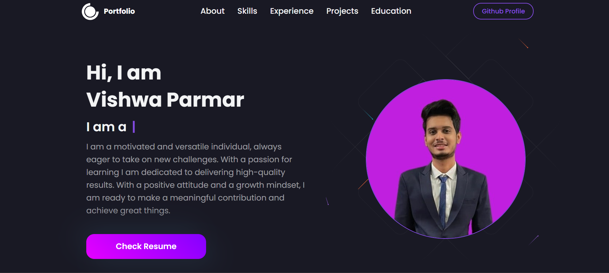

# 🚀 Vishwa Parmar - Portfolio Website

Welcome to my personal developer portfolio! This website showcases my projects, experiences, skills, and achievements as a software developer. It serves as a central hub to get to know more about me, my background, and the work I've done.

## 🌐 Live Demo

🔗 [Click here to visit the live portfolio](https://vishwaparmar.com)

---

## 📸 Preview

> 

---

## ✨ Features

- 💼 Interactive display of **work experiences**
- 📚 Showcases **educational background**
- 🛠️ Highlights technical **skills** and **projects**
- 🔄 Fully responsive design

---

## 🧰 Tech Stack

- **Frontend**: ReactJS, Styled-Components, JavaScript
- **Styling**: CSS-in-JS (Styled-Components), Material UI
- **Form Handling**: EmailJS
- **Version Control**: Git & GitHub
- **Hosting**: Netlify / Render / GitHub Pages

---

## 📂 Folder Structure

```
📦 src
 ┣ 📁 components        # Reusable UI components
 ┣ 📁 images            # All static assets
 ┣ 📁 sections          # Home, About, Experience, Projects, Contact, etc.
 ┣ 📄 App.js            # Main app component
 ┣ 📄 index.js          # Entry point
```

---

## 🛠️ Getting Started

### 1. Clone the Repository

```bash
git clone https://github.com/VishwaParmar/Vishwa-Portfolio.git
cd Vishwa-Portfolio
```

### 2. Install Dependencies

```bash
npm install
```

### 3. Configure EmailJS

Create a `.env` file in the root with the following environment variables:

```env
REACT_APP_EMAILJS_SERVICE_ID=your_service_id
REACT_APP_EMAILJS_TEMPLATE_ID=your_template_id
REACT_APP_EMAILJS_USER_ID=your_user_id
```

You can get these values from your [EmailJS Dashboard](https://dashboard.emailjs.com/).

### 4. Start the Development Server

```bash
npm start
```

Your portfolio will be running locally at [http://localhost:3000](http://localhost:3000)

---

## 🧪 Testing Email Form

1. Fill out and submit the contact form
2. You should receive an email via EmailJS
3. Make sure your EmailJS credentials are set properly in `.env` and deployed settings

---

## 📦 Deployment

You can deploy your portfolio using:
- [Netlify](https://netlify.com/)
- [Render](https://render.com/)
- [GitHub Pages](https://pages.github.com/)
- [Vercel](https://vercel.com/)

> Make sure to set your `.env` variables in your deployment platform.

---

## 🙌 Acknowledgements

- [EmailJS](https://www.emailjs.com/)
- [Material UI](https://mui.com/)
- [Styled Components](https://styled-components.com/)
- Inspiration from fellow dev portfolios

---

## 📬 Contact

Feel free to connect with me:

- 💼 [LinkedIn](https://www.linkedin.com/in/vishwa-parmar-347b291b3/)
- 💻 [GitHub](https://github.com/VishwaParmar)
- 📫 Email: parmarvishwa70@gmail.com

---

_Thanks for visiting! ⭐ Don't forget to star the repo if you liked it._
```